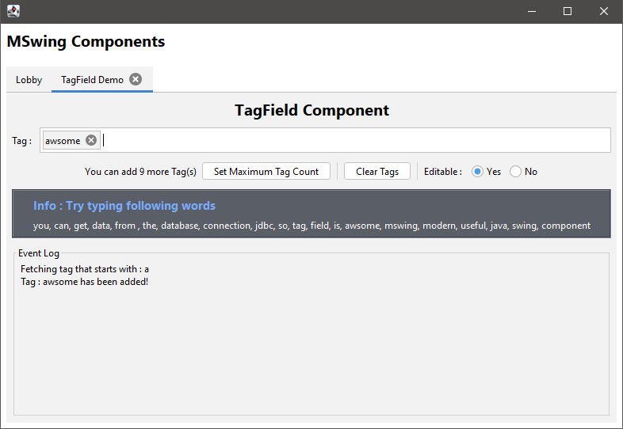
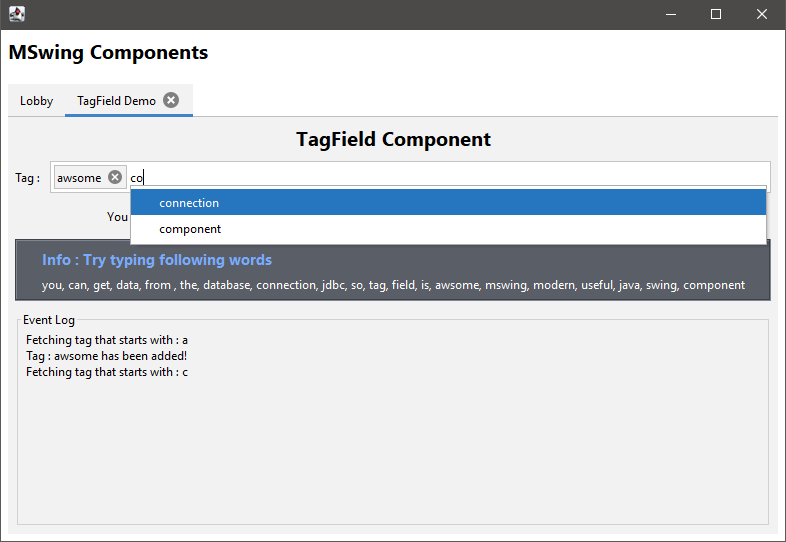

   

## Latest Release Downloads
 

## Currently Available Components
##### TabbedPane
- Modified version of JTabbedPane
- Create a tab _with_ or _without_ *close button* by using `addTab` function
- Add listener to do extra operation when _tab removed_ or _closed_ by adding `TabListener`
##### TagField
- Add or remove *_tag_*
- When we type some text, filter result will popup for that input if there are some expected tags available
- Add Listener to do extra operation when _tag added_, _tag removed_ and _collecting expected tags_ by adding `TagFieldListener`
- Control over filtering result through `collectingExpectedTags` function of `TagFieldListener`.
- Connect with the database for filtering result to collect expected tags
## Other
##### ButtonGroup
- Modified version of original ButtonGroup
- Add Listener to do extra operation when _selection changed_ by adding `ButtonGroupSelectionChangedListener`

## Next Coming Component
###### TextField
- This will be a modified version of JTextField with more extra features

## Demo App Preview
 
